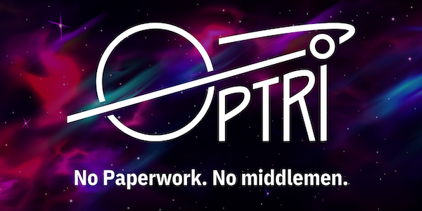

 

  <a href="https://optrispace.com/" target="_blank">
    <picture>
      <source media="(prefers-color-scheme: dark)" srcset="./assets/optrispace-logo-with-slogan.png">
      
    </picture>
  </a>

<h1 align="center">Brand New Platform for Freelancers and Customers</h1>

  <a href="https://sagittarius.optrispace.com/" rel="dofollow"><strong>No Middlemen. No Paperwork. Fast & Secure Payments.</strong></a>
   
   
  <a href="https://discord.gg/7WEbtmuqtv">Join Our Discord</a>
  ·
  <a href="https://www.linkedin.com/company/optriment">LinkedIn</a>
  ·
  <a href="https://twitter.com/optrispace">Twitter</a>

 

  <a href="https://github.com/optriment/optrispace-contract-v2/blob/master/CODE_OF_CONDUCT.md">Code of Conduct</a>
  ·
  <a href="https://github.com/optriment/optrispace-contract-v2/blob/master/CONTRIBUTING.md">Contributing</a>

## Why OptriSpace?

We are OptriSpace - an international team who got together to face a challenge
and build a brand-new platform for people like us: freelancers, recruiters and
entrepreneurs. We provide a platform for people looking for jobs or for
professionals for their projects.

Our platform is based on the blockchain technology and uses cryptocurrency as a
payment method. That makes OptriSpace secure and fast. Smart contracts protect
customers and freelancers from third parties and middlemen. Smart contracts
handle all logic depends on terms and conditions which have to be signed by both
participants.

## Features

- No paperwork
- No middlemen
- No managers
- No third parties
- Fast & secure payments
- No fees
- Powered by Smart Contracts (Binance Smart Chain)
- All of our code is open source
- All payments in crypto
- Born to work globally
